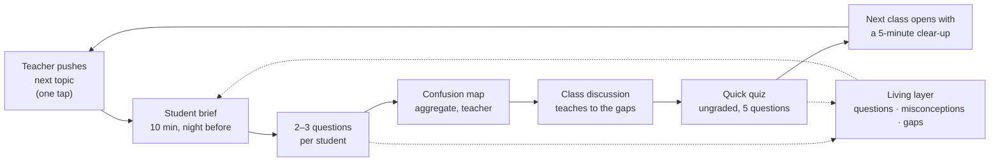

# Living Syllabus

**The flipped-classroom operating layer built on the [WikiSyllabus](https://github.com/The-Purple-Movement/WikiSyllabus) commons.**

AI that prepares students to ask better questions, shows teachers where the class actually is, and writes what it learns back into the syllabus. Not a tutor — the layer that makes any AI institution-aware, with the classroom as the place its output gets tested against a human teacher.

A [Beyond Syllabus](https://capabilitycommons.com) project by The Purple Movement.

## The session rhythm

1. **Teacher pushes the next topic** — one tap, from the real syllabus.
2. **Students run the pre-class brief** — a bounded, Socratic 10-minute AI session that ends with the 2–3 questions each student genuinely cannot answer.
3. **Teacher opens the confusion map** — what the class understood, what confused them, the top question clusters. Aggregate only, never individuals.
4. **Class teaches to the gaps** — the lecture shrinks; the questions get discussed.
5. **Quick quiz** — one tap, five ungraded questions generated from the confusion clusters. Measures whether the discussion actually resolved the confusion.
6. **Next class opens with a clear-up** — unresolved areas carry forward visibly. Nothing is silently lost.

Every session enriches the **living layer**: real question banks, recurring misconceptions, and curriculum gaps, keyed to WikiSyllabus file paths and written back to the commons as forkable YAML.

## Principles

- **Contribution is visible, struggle is private.** Names go on questions students choose to claim; nothing that measures confusion is ever individual.
- **The teacher's effort budget is three minutes outside class.** Every teacher action is one tap or it doesn't ship.
- **The hallway test gates every screen.** A first-year student or a 30-year veteran professor must complete the core action unaided, first try. See [UX principles](docs/UX-PRINCIPLES.md).
- **SOLID at the boundaries.** A pure domain core, ports for everything external, adapters at the edge. See [Architecture](docs/ARCHITECTURE.md).

## Documentation

| Doc | What it covers |
| --- | --- |
| [docs/SPEC.md](docs/SPEC.md) | Product spec v0.2 — the rhythm, surfaces, visibility rules, data schema |
| [docs/ARCHITECTURE.md](docs/ARCHITECTURE.md) | SOLID module boundaries, ports & adapters, repo layout |
| [docs/UX-PRINCIPLES.md](docs/UX-PRINCIPLES.md) | The hallway test and the rules that keep the UI self-evident |
| [docs/PLAYBOOK.md](docs/PLAYBOOK.md) | Which Claude skill to invoke at each stage of the sprint cycle |

## Working on this

The backlog lives in [Issues](../../issues): epics are labels (`epic: …`), sprints are milestones with dates. Start with the current sprint's milestone. Each issue names the skill to invoke when working on it — see the [playbook](docs/PLAYBOOK.md).

## License

[MIT](LICENSE) — same as WikiSyllabus. Built in the open.
